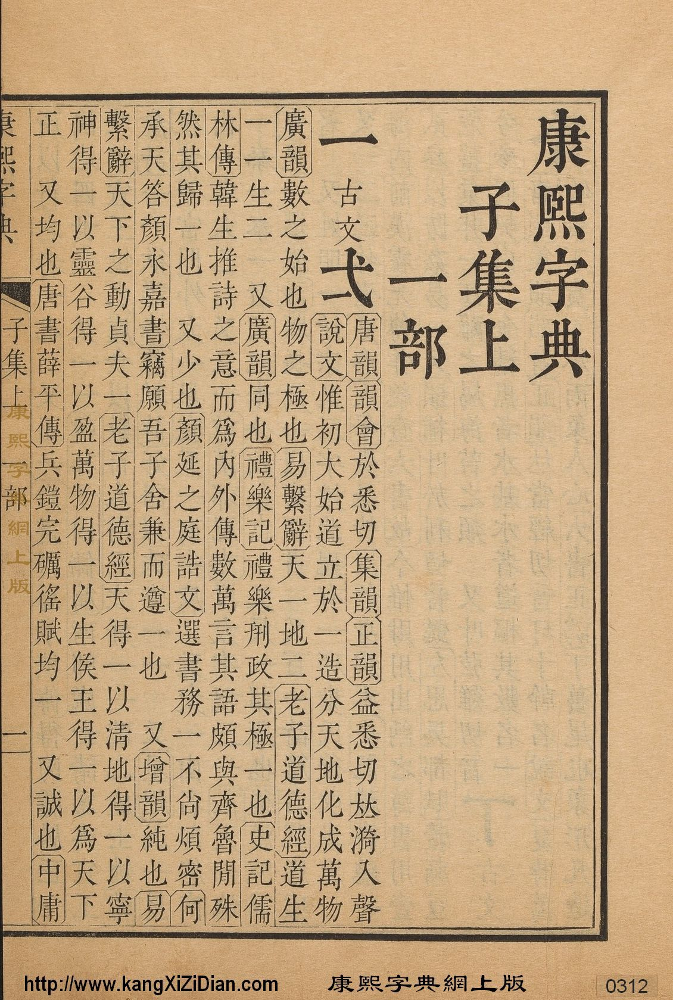

# vscode-guji-preview

|    特殊符号    |  作用范围  |       含义       |
| :------------: | :--------: | :--------------: |
| `//`_comment_  |   至行尾   |      行注释      |
|    `@`_num_    |   至行尾   |   指定当前页数   |
|     `空行`     |            |     大行换行     |
|     `EOF`      |            |     大行换行     |
|   `#␣`_text_   |   至行尾   |     一行大字     |
|  `##␣`_text_   |   至行尾   | 一行大字缩进一格 |
|  `###␣`_text_  |   至行尾   | 一行大字缩进两格 |
|  `↵` (换行符)  |            |     小行换行     |
|   `#`_char_    | 后一个字符 |  行内的一个大字  |
| `【`_text_`】` | 括号内文本 |     行内书名     |
| `【`_text_`↵`  | 括号至行尾 |    行内半书名    |
| `^`_text_`】`  | 行首至括号 |    行内半书名    |
|      `*`       |     无     |     行内空格     |

## 例子

《康熙字典》武英殿版第三一二页:



对应的 guji 文档如下:

```gj
// 0312.gj

@312

# 康熙字典

## 子集上

### 一部

#一古文#弌【唐韻】【韻會】於悉切【集韻】【正韻】益悉切𠀤漪入聲
【說文】惟初大始道立於一造分天地化成萬物

【廣韻】數之始也物之極也【易繫辭】天一地二【老子道德經】道生
一一生二*又【廣韻】同也【禮樂記】禮樂𠛬政其極一也【史記儒

林傳】韓生推詩之意而爲內外傳數萬言其語頗與齊魯閒殊
然其歸一也*又少也【顏延之庭誥文】選書務一不尚煩密【何

承天答顏永嘉書】竊願吾子舍兼而遵一也*又【增韻】純也【易
繫辭】天下之動貞夫一【老子道德經】天得一以淸地得一以寧

神得一以靈谷得一以盈萬物得一以生侯王得一以爲天下
正*又均也【唐書薛平傳】兵鎧完礪徭賦均一*又誠也【中庸】
```
